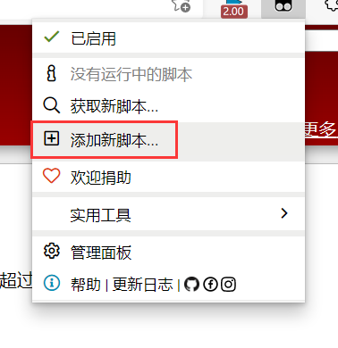

### 职教云自动刷课脚本

脚本名称：职教云|智慧职教助手[稳定版]

脚本主体：职教云x.x.js

脚本版本：v1.0

   

#### 使用方法：
1.下载js文件，油猴点击添加新脚本

2.复制下载的js脚本主体，删除原来的，将脚本粘贴进去，ctrl+s保存即可使用。

2.  1.或者直接通过网址安装:[职教云|智慧职教助手[稳定版]](https://greasyfork.org/zh-CN/scripts/432222-%E8%81%8C%E6%95%99%E4%BA%91-%E6%99%BA%E6%85%A7%E8%81%8C%E6%95%99%E5%8A%A9%E6%89%8B-%E7%A8%B3%E5%AE%9A%E7%89%88)

3.职教云进入相应的课程首页即可，脚本就会自动开始。
   

### 共同开发

1.如果你也对本脚本感兴趣，你可以使用git以及github或者gitee协作开发。

2.当你发现一个bug，你可以通过添加到lssues，这样所有关注本脚本的就都可以关注到这个bug,可以促进这个bug的修复。

3.你对某一个功能有更好的解决方案，你可以先Fork到你自己的仓库，自己进行开发，如果你也有着开源精神，或者想让我我看看你写的比我的更好，你可以Pull requests提交给我。如果你写的确实更好，我会将你的代码合并进来，并发布新版本。

## 介绍
1.登录智慧职教，点击需要刷课的课程即可
2.可以结合浏览器插件一起使用（倍数别太高）
3.第一次观看视频请手动静音
4.可以手动过滤重复刷的内容（详情见说明）
作者说明
因为临近毕业要找工作了，所以脚本更新的少，而且有些问题现在还解决不了，还需要继续深造。
我写了一个网站，大家可以去看看，里面也可以反馈，也还有一些问题。
本来准备彻底做好了在发出来的，但是还有一个框架没学，面试需要那个框架，还需要继续学习，最近没有时间开发了，所以就先放出来了

网站地址：枫叶网

因为服务器比较垃圾，速度可能有点慢；还有没钱买域名，所以网址是ip地址。

http://121.196.195.71:8080/maple/

补充说明

1.脚本开发周期较短阶段，作者道行不够等原因，bug存在在所难免；如果发现bug也请提交给我，我会尝试修复。

2.如果使用了浏览器视频倍数插件，最好在2倍以内，这个范围暂时没有问题(看脸)。

3.出现异常也不用担心，30分钟之后又是一条好汉

4.手动排除重复刷的内容：赋值内容名，粘贴到如图所示的代码中去

5.网络不好的时候最容易出现异常，有时候需要手动刷新一下

6.目前还有一个已知的bug，就是视频停止了要手动点击一下，这个是我的道行的问题，如果有了解的，可以反馈告诉我

7.这是目前最稳定的版本了

更新说明

*全面优化了课程首页的选择机制，加入了故障排除

*重新编写了课程首页的代码，优化了一个模块结束不自动下一个的问题,以及空章节卡死问题

*加入了自定义重刷内容排除功能，有些内容一直重复刷，请复制它的课程名，粘贴到代码中，可以有多个

*重新编写了学习页面的逻辑实现，优化了算法

*ppt,文档都由之前的点击之后等待变为点击一张等待一会儿，结束后延迟一下就返回首页

*这次更新了后面可能就不会怎么更新了，可能之后又bug的时候更一下，还的有时间才行